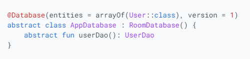

# Read29

## Overview: Saving data with Room

## Setup
**To use Room in your app, add the following dependencies to your app's build.gradle file:**

dependencies 
    def room_version = "2.3.0"

    implementation "androidx.room:room-runtime:$room_version"
    annotationProcessor "androidx.room:room-compiler:$room_version"

## Primary components
- The database class that holds the database and serves as the main access point for the underlying connection to your app's persisted data.
- Data entities that represent tables in your app's database.
- Data access objects (DAOs) that provide methods that your app can use to query, update, insert, and delete data in the database.

## Database
The following code defines an AppDatabase class to hold the database. AppDatabase defines the database configuration and serves as the app's main access point to the persisted data. The database class must satisfy the following conditions:

- The class must be annotated with a @Database annotation that includes an entities array that lists all of the data entities associated with the database.
- The class must be an abstract class that extends RoomDatabase.
- For each DAO class that is associated with the database, the database class must define an abstract method that has zero arguments and returns an instance of the DAO class.

